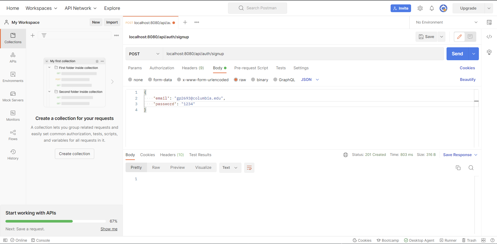
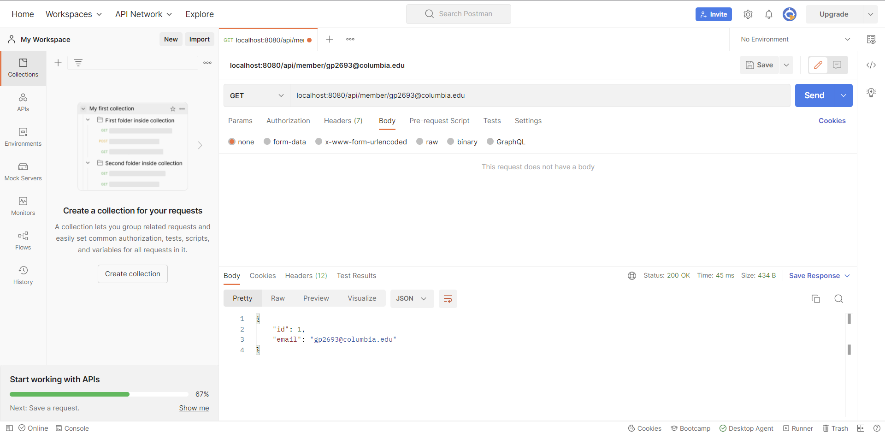
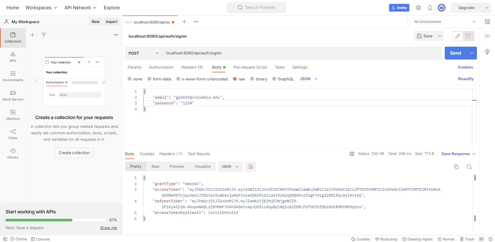

# jwt-authentication

* Tech Stacks, Technologies, and Tools
  * Spring Boot
  * JSON Web Token
  * H2
  * Rest API
  * Postman
  
* Post signup url

* Get member url

* Post signin url and response tokens

